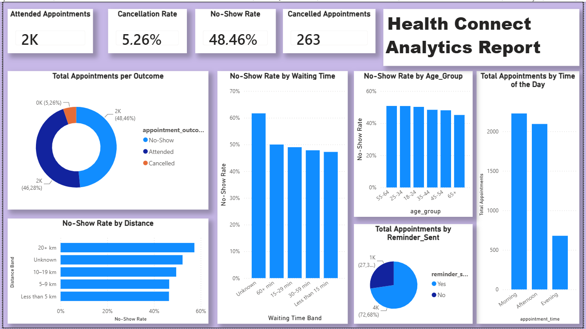

# AnalystLab_Africa_Week5
# HealthConnect Appointment Analytics Dashboard

## Project Overview

HealthConnect is a healthcare appointment analytics project focused on understanding patient attendance, cancellations, and no-shows.

The objective of this project is to use data analytics and visualisation to identify patterns that may help improve appointment attendance, reduce missed appointments, and support more efficient clinic operations.

This project was developed as part of the AnalystLab Africa HealthConnect Experience Lab.

## Business Problem

Healthcare providers may lose valuable appointment capacity when patients cancel appointments or fail to attend scheduled appointments.

The key business question explored in this project is:

> How can HealthConnect use appointment data to reduce patient no-shows, improve attendance, and support more efficient clinic operations?

## Objectives

The objectives of this analysis were to:

- Inspect and prepare the appointment dataset.
- Investigate appointment outcomes.
- Analyse factors associated with no-shows.
- Develop meaningful healthcare appointment KPIs.
- Create an interactive Power BI dashboard.
- Identify business insights and potential operational recommendations.
- Highlight data-quality issues, limitations, and areas for further investigation.

## Dataset

The dataset contains appointment-level information, including:

- Appointment ID
- Patient ID
- Gender
- Age and age group
- Appointment type
- Appointment date and time
- Booking date
- Booking lead time
- Previous appointments
- Previous no-shows
- Reminder status and channel
- Distance to clinic
- Waiting time
- Appointment outcome

The appointment outcomes include:

- Attended
- No-Show
- Cancelled

## Tools and Technologies

- **Python** — Initial data inspection and analysis
- **Pandas** — Data preparation and exploratory analysis
- **PostgreSQL** — Data storage and SQL analysis
- **Power BI** — Dashboard development and visualisation
- **DAX** — KPI calculations and analytical measures
- **GitHub** — Project documentation and version control

## Key Performance Indicators

The dashboard includes the following KPIs:

| KPI | Description |
|---|---|
| Attended Appointments | Number of appointments attended by patients |
| Cancellation Rate | Percentage of appointments that were cancelled |
| No-Show Rate | Percentage of appointments that were not attended |
| Cancelled Appointments | Total number of cancelled appointments |

### KPI Results

Based on the initial dashboard:

- **Attended Appointments:** Approximately 2K
- **Cancellation Rate:** 5.26%
- **No-Show Rate:** 48.46%
- **Cancelled Appointments:** 263

## Dashboard

The Power BI dashboard analyses:

- Appointment outcomes
- No-show rate by waiting-time band
- No-show rate by distance to clinic
- No-show rate by age group
- Appointment volume by time of day
- Appointment distribution by reminder status

## Initial Findings

### 1. No-shows are the main appointment-management challenge

The no-show rate was approximately 48.46%, making no-shows the largest appointment outcome category.

This suggests that HealthConnect should prioritise strategies that improve appointment attendance.

### 2. Cancellation rate is lower than the no-show rate

The cancellation rate was 5.26%, representing 263 cancelled appointments.

This suggests that missed appointments are a larger operational challenge than cancellations.

### 3. Patients living farther from the clinic show higher no-show rates

The 20+ km distance band had a relatively high no-show rate.

This may indicate that travel distance or accessibility could influence appointment attendance.

### 4. No-show rates vary across age groups

Differences were observed between age groups, suggesting that attendance patterns may vary across patient demographics.

However, age should be considered alongside other factors rather than treated as the sole explanation for no-shows.

### 5. Morning appointments have the highest appointment volume

Morning appointments represented the busiest period in the dashboard.

This may help HealthConnect review staffing, waiting times, and appointment scheduling during high-demand periods.

### 6. Missing data requires further investigation

Missing values were identified in fields such as:

- Distance to clinic
- Waiting time
- Reminder channel

The Unknown categories should be investigated before making major operational decisions.

## Data Preparation

The data preparation process included:

- Reviewing column names and data types
- Inspecting missing values
- Reviewing appointment outcome categories
- Creating distance bands
- Creating waiting-time bands
- Preparing fields for Power BI analysis
- Validating KPI calculations

Missing values were retained in some analytical categories as `Unknown` so that their potential impact could be investigated rather than automatically excluded.

## Business Recommendations

Based on the initial analysis, HealthConnect could consider:

1. Improving appointment reminder coverage.
2. Introducing easier appointment confirmation and rescheduling.
3. Investigating the reasons for high no-show rates.
4. Providing additional support for patients living farther from the clinic.
5. Reviewing staffing during busy appointment periods.
6. Improving the recording of distance, waiting time, and reminder information.
7. Analysing previous no-shows and booking lead time to identify higher-risk appointments.

## Limitations

- The dataset may not represent all clinic activity.
- Some variables contain missing values.
- The analysis identifies relationships but does not prove causation.
- The dataset does not necessarily explain why patients missed appointments.
- Reminder effectiveness requires further comparison by reminder status and channel.
- The dashboard is an initial analytical output and requires further validation.

## Future Work

Planned next steps include:

- Analyse no-show rates by reminder status and channel.
- Investigate previous no-shows and booking lead time.
- Validate dashboard calculations and findings.
- Obtain feedback from other project tracks.
- Refine the dashboard design.
- Explore potential predictive analytics for identifying appointments at higher risk of no-show.
- Finalise the HealthConnect analytics report.

## Project Status

**Status:** Initial analytics dashboard completed.

**Next phase:** Dashboard refinement, additional analysis, validation, and cross-track collaboration.

## Author

**Zakheni Mathonsi**

Data Analyst | Aspiring Data Engineer

Skills demonstrated in this project:

`Python` `Pandas` `PostgreSQL` `SQL` `Power BI` `DAX` `Data Cleaning` `EDA` `Data Visualisation` `Business Intelligence`
